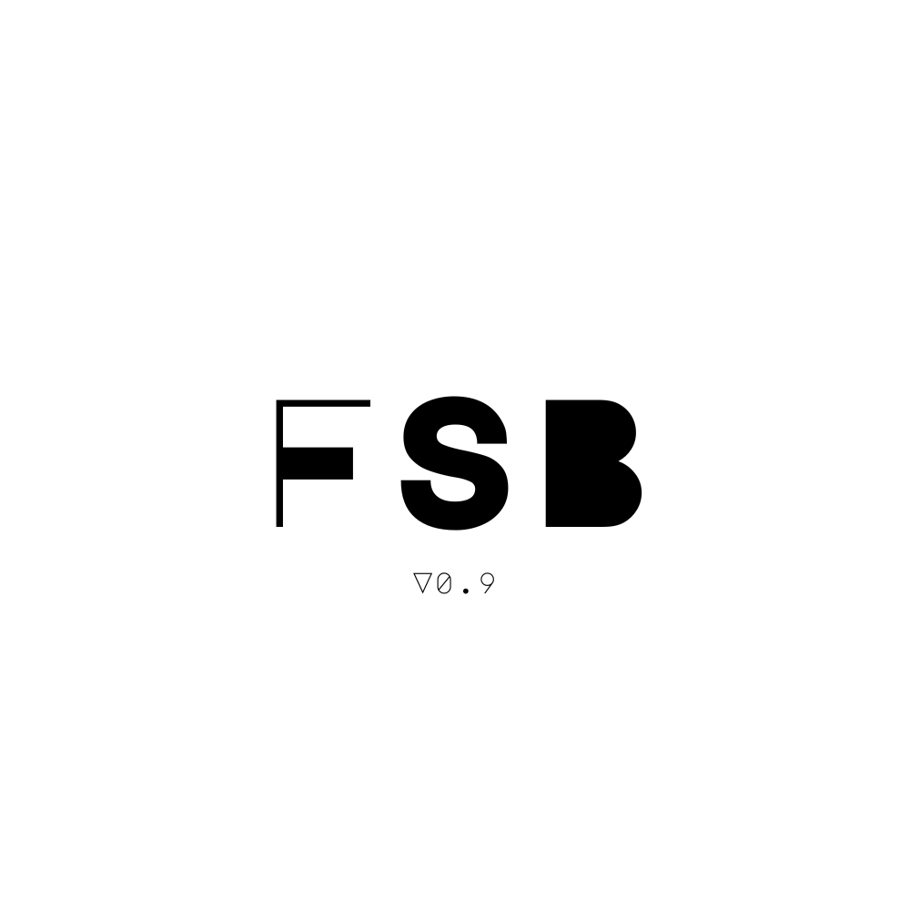
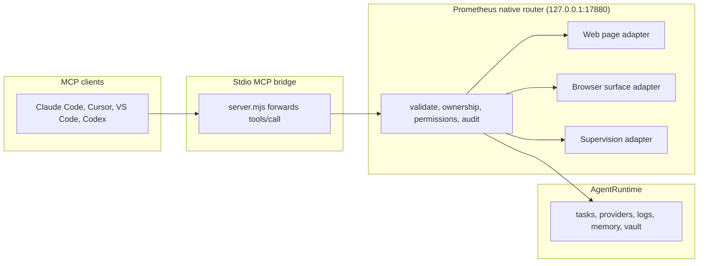
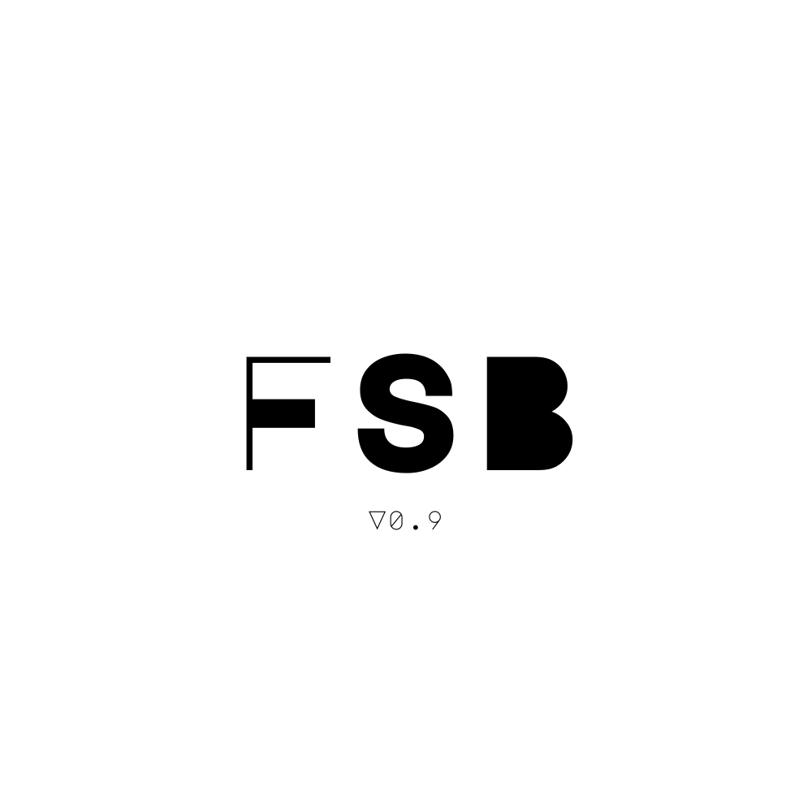

<div align="center">

<picture>
  <source media="(prefers-color-scheme: dark)" srcset="assets/fsb_logo_dark.png" />
  <source media="(prefers-color-scheme: light)" srcset="assets/fsb_logo_light.png" />
  
</picture>

# Prometheus

**The agent native desktop browser. Full control of the whole browser through structure, not screenshots.**

*Powered by FSB. Pure structural intelligence. Zero vision. Zero guessing.*


[](https://github.com/fullselfbrowsing/Prometheus/stargazers)
[](https://github.com/fullselfbrowsing/Prometheus/network/members)
[](https://github.com/fullselfbrowsing/Prometheus/issues)
[](https://github.com/fullselfbrowsing/Prometheus/commits/main)

[Why I Built This](#why-i-built-this) · [Overview](#overview) · [Why DOM First](#why-dom-first) · [The Whole Browser](#the-whole-browser-not-just-the-page) · [Architecture](#architecture) · [Features](#features) · [Native Control Surface](#native-control-surface) · [MCP Bridge](#mcp-bridge) · [Quick Start](#quick-start) · [Repository Layout](#repository-layout) · [License](#license-and-attribution)

</div>

---

## Why I Built This

While I have been developing FSB, there were a lot of issues with Chrome's policies and inability to access non web pages and JavaScript execution. At a point I was like, fuck it. I'm gonna do it myself, I'm gonna solve everything and create a fucking browser.

And that's what this is.

---

## Overview

Prometheus is an agent native desktop browser built on Qt and QtWebEngine. It brings Full Self Browsing's DOM first automation into the browser itself, so AI agents and the humans supervising them can inspect, script, click, type, navigate, configure, and recover across the whole browser through first class native structure instead of screenshots, brittle extension injection, or human only UI.

Where a Chrome extension can only reach the page, Prometheus owns the browser. Agents drive normal web pages and the surfaces an extension can never touch: settings, tabs, downloads, history, and internal pages. Every action runs through a typed native command router with tab ownership, permission boundaries, change reports, and an audit log.

> **Status:** Prometheus is an active build. The native control spine, the stdio MCP bridge, multi agent tab ownership, the runtime sidebar, DOM native supervision, and a repeatable macOS artifact are in place. Treat it as supervised automation software: keep a human in the loop and test on non critical pages first.

### What it does

* Drives the live DOM through a native command router: read structure, run page scripts, click, type, scroll, and verify what changed.
* Controls browser owned surfaces, not just the page, including settings, tabs, downloads, history, and internal pages.
* Exposes a dependency free stdio MCP bridge so Claude Code, Cursor, VS Code, Codex, and other MCP clients can drive the browser.
* Enforces multi agent tab ownership with typed recovery errors so several agents can share one browser safely.
* Ships a native sidebar with Task, Providers, Logs, Memory, and Vault panels, keeping provider and vault secrets off the agent transports.
* Mirrors supervised sessions as structured DOM snapshots and hash diffs rather than pixel or video streaming.
* Keeps provider flexibility: xAI, Gemini, OpenAI, Anthropic, OpenRouter, LM Studio, and custom OpenAI compatible endpoints.

---

## Why DOM First

Vision first agents read the page as pixels. Prometheus reads the page as structure, then verifies the result before it moves on.

| Metric | Vision based agents | Prometheus |
|--------|---------------------|------------|
| Page understanding | Screenshots | DOM, selectors, ARIA, forms, structure |
| Browser surfaces | The visible page only | Pages plus settings, tabs, downloads, history, and internal pages |
| Typical per step latency | 1 to 3 seconds | 50 to 200 ms |
| Auditability | Opaque frames | Typed tools, change reports, and a JSONL audit log |
| Cost profile | Image heavy | Text and structure heavy |

The browser stays the source of truth. The model receives structured page context, makes a tool decision, and the browser verifies what changed before the next step.

---

## The Whole Browser, Not Just the Page

A content script lives inside one web page. That is the wrong boundary for an agent that needs to configure providers, manage tabs, read history, or recover a stuck session.

Prometheus puts the control layer inside the browser process, so an agent can reach surfaces a page script never could:

* **Browser owned pages** through `open_internal_surface`, including settings and internal views.
* **Tabs and windows** through native tab and window APIs rather than page level guesses.
* **Direct page scripts** through `execute_js`, with DOM snapshots for read back and verification.
* **Runtime and supervision state** through the same router that drives the page, so tasks, logs, and live mirrors share one contract.

---

## Architecture

Prometheus is a layered control spine. An MCP client talks to a small stdio bridge, the bridge forwards each call to a native JSON router on a loopback port, and the router selects a surface adapter, acts, waits, verifies, and returns a typed result.



Every command follows the same lifecycle: validate the tool, enforce permissions and tab ownership, select a surface adapter, execute the action, wait for observable state, verify the result, and return a normalized change report. The router speaks a small structured protocol: `POST /agent/command` with `tool`, an optional `id`, and optional `params`, returning an `{ ok, id, tool, result }` envelope or a typed `error`, with each call written to a JSONL audit log under the active profile.

The loopback command server is disabled by default and only listens when `PROMETHEUS_AGENT_PORT` is set, so the browser carries no open agent surface until you ask for one.

---

## Features

| Area | What it does |
|------|--------------|
| Native command router | Validates tools, enforces ownership and permissions, returns typed errors and change reports, and writes a JSONL audit log. |
| Whole browser control | Drives web pages plus browser owned surfaces such as settings, tabs, downloads, history, and internal pages. |
| Direct page scripts | Runs `execute_js` against the live page with DOM snapshot read back and verification. |
| Structural reads | Captures DOM snapshots, page snapshots, text, and attributes for selectors, forms, ARIA labels, and hidden controls. |
| Multi agent ownership | Assigns server side agent identities, enforces tab ownership on mutating tools, and returns typed recovery errors. |
| MCP bridge | A dependency free Node stdio bridge that maps the MCP tool contract onto native routes. |
| Native sidebar | Task, Providers, Logs, Memory, and Vault panels that keep secrets off the agent and MCP transports. |
| Provider flexibility | xAI, Gemini, OpenAI, Anthropic, OpenRouter, LM Studio, and custom OpenAI compatible endpoints, with live model discovery. |
| Vault | Native, confirmation gated credential and autofill flows for supervised use. |
| Memory and site guides | Stores past sites, workflows, and guidance the runtime can recall. |
| DOM native supervision | Mirrors supervised sessions as structured snapshots and hash diffs, addressed by stable identity, instead of video. |
| Compact native chrome | An optional Safari style compact layout where tabs share the toolbar and the active tab becomes the address and search field. |
| Advanced tab management | Tab groups, overview and search, quick switch, restore, unload and suspend, duplicate, detach, and reorder. |
| Offline icons and themes | Bundled offline Font Awesome Free assets and minimal Prometheus themes that do not depend on the network or host theme. |

---

## Native Control Surface

The native router and MCP bridge expose 46 tools across the browser, the runtime, and supervision.

| Group | Tools |
|-------|-------|
| Tabs and navigation | `list_tabs`, `new_tab`, `switch_tab`, `navigate`, `reload`, `close_tab`, `wait_for_load` |
| Reading and snapshots | `read_page`, `get_text`, `get_attribute`, `get_dom_snapshot`, `get_page_snapshot` |
| Page actions | `execute_js`, `click`, `type`, `press_key`, `scroll`, `hover`, `select`, `clear`, `drag_drop` |
| Browser surfaces | `open_internal_surface`, `diagnostics` |
| Tasks and runtime | `submit_task`, `cancel_task`, `task_status`, `list_tasks` |
| Providers | `get_provider_config`, `list_providers`, `discover_models`, `set_provider_config` |
| Observability | `list_runtime_logs`, `action_history`, `runtime_diagnostics` |
| Memory and site guides | `save_memory`, `list_memory`, `save_site_guide`, `list_site_guides` |
| Vault | `create_vault_entry`, `list_vault_entries`, `vault_autofill` |
| Supervision | `create_supervision_pairing`, `start_supervision_session`, `get_supervision_snapshot`, `get_supervision_diff`, `end_supervision_session` |

### Multi agent safety

Several agents can share one browser. Mutating tools require tab ownership, and the router returns typed errors so a client can recover instead of guessing.

| Error | Meaning |
|-------|---------|
| `TAB_OWNED_BY_OTHER_AGENT` | A mutating tool targeted a tab owned by a different agent. |
| `AGENT_CAP_REACHED` / `PROMETHEUS_AGENT_CAP` | The concurrent agent limit was reached. |
| `ELEMENT_NOT_FOUND` | The target element could not be resolved on the page. |
| `NO_BROWSER_TARGET` | No browser window or tab was available to act on. |
| `SECRET_TRANSPORT_BLOCKED` | A tool tried to move provider or vault secrets across an agent transport. |
| `VAULT_NATIVE_CONFIRMATION_REQUIRED` | A vault action needs native user confirmation before it proceeds. |
| `STALE_SUPERVISION_SESSION` | A supervision read used an unknown or expired session. |
| `SUPERVISION_TARGET_MISMATCH` | A supervision read targeted a tab the session does not own. |

Visual session intent travels with each call through the implicit `client`, `visual_reason`, and `is_final` fields, and the browser surfaces the current action in its status bar.

---

## MCP Bridge

The bridge is a single dependency free Node script. It speaks MCP over stdio to your client and forwards each `tools/call` to the native router over loopback.

1. Launch Prometheus with the agent port enabled:

   ```bash
   PROMETHEUS_AGENT_PORT=17880 open -a Prometheus
   ```

2. Point an MCP client at the bridge. It forwards to the router named by `PROMETHEUS_AGENT_URL` and defaults to `http://127.0.0.1:17880`:

   ```bash
   PROMETHEUS_AGENT_URL=http://127.0.0.1:17880 node falkon/tools/prometheus-mcp/server.mjs
   ```

3. From your client, ask the browser to act: read the current page, open a settings surface, or run a task.

The router contract is intentionally small, so the same `POST /agent/command` endpoint backs both the bridge and any direct local integration.

---

## Quick Start

Prometheus builds from the Qt and QtWebEngine source under `falkon/` with CMake.

```bash
# Configure and build
cmake -S falkon -B falkon/build -DCMAKE_BUILD_TYPE=Release
cmake --build falkon/build

# Run the release validation gate (build, browser smoke, agent, MCP, packaging, legal)
falkon/tools/fsb-baseline/release-validate.sh

# Package a local macOS artifact
falkon/tools/fsb-baseline/package-macos.sh
```

Focused smoke checks live alongside the release gate: `smoke-browser.sh`, `smoke-agent-control.sh`, `smoke-mcp-bridge.sh`, and `smoke-compact-tabs.sh`. The MCP bridge has its own self check at `falkon/tools/prometheus-mcp/smoke.mjs`.

Provider and vault secrets are entered through the native sidebar and stored in the macOS Keychain on the first platform, never through the agent or MCP transports.

---

## Supervision

Prometheus mirrors a supervised session the same way Full Self Browsing thinks about pages: as structure. A session captures one structured DOM snapshot and then small hash addressed diffs, so a remote viewer follows the live page at a fraction of the cost of streaming pixels, and every node stays queryable and addressable.

Supervision reads require a session created through `create_supervision_pairing` and `start_supervision_session`. The router rejects unknown, expired, or target mismatched sessions with typed errors, so a stale viewer can never read or corrupt the wrong tab.

---

## Repository Layout

| Path | What lives here |
|------|-----------------|
| `falkon/src/lib/agent/agentcommandrouter.*` | Native JSON command router: tool validation, tab ownership, typed errors, and the audit log. |
| `falkon/src/lib/agent/agentruntime.*` | AgentRuntime: tasks, providers, logs, diagnostics, memory, site guides, and vault state. |
| `falkon/src/lib/agent/agentruntimesidebar.*` | Native sidebar with Task, Providers, Logs, Memory, and Vault panels. |
| `falkon/tools/prometheus-mcp/server.mjs` | Dependency free Node stdio MCP bridge that forwards tool calls to the native router. |
| `falkon/tools/fsb-baseline/` | Build, smoke, packaging, release validation, and legal inventory scripts. |
| `falkon/src/` | Qt and QtWebEngine browser shell. |
| `falkon/COPYING` | GPLv3 license text. |
| `.planning/` | Product planning and phase records. |

---

## License and Attribution

Prometheus is released under the **GNU General Public License, version 3 or later**. The full text lives in `falkon/COPYING`.

Prometheus is built on the Falkon browser from the KDE community and on Qt and QtWebEngine. Product visible identity is Prometheus, with **Powered by FSB** as the affiliation, but the inherited GPL, Qt, KDE, and Falkon copyright and license notices are preserved in full, and the source availability obligations of the GPL are honored. The legal inventory is tracked at `falkon/tools/fsb-baseline/legal-notice-inventory.md`.

Prometheus is supervised, auditable automation software. It is intentionally not a stealth browser, a scraper farm, or an unsupervised account operator.

<div align="center">

<picture>
  <source media="(prefers-color-scheme: dark)" srcset="assets/fsb_logo_dark_footer.png" />
  <source media="(prefers-color-scheme: light)" srcset="assets/fsb_logo_light_footer.png" />
  
</picture>

**Prometheus** · Powered by FSB

</div>
